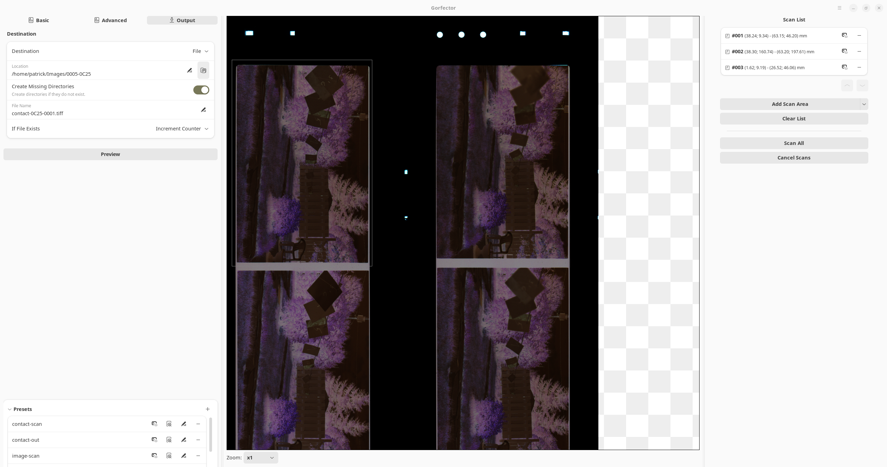

# Gorfector

[](https://github.com/patrickfournier/gorfector/actions/workflows/ubuntu-latest-build-test.yml)

The General Observable Record Freight Extractor (**Gorfector**) is an image scanning software.

Being relatively new, it has not been tested with a lot of scanners yet. Currently, it is known to work with:

- Epson Perfection V600 Photo

However, it should work with any scanner that supports the SANE protocol. Please report any issues you encounter with
your scanner so we can improve compatibility.

## Features

- User-friendly scan parameters presentation
- Zoomable, high-resolution previews
- Batch scanning of multiple areas in a single document (useful for scanning negatives)
- User defined presets
- Output to file (TIFF, PNG, JPEG), to email or to printer
- Adwaita/GTK4 user interface
- Saves pixels straight from the scanner: no image processing is done

[](data/metainfo/main.png)
*The main window of Gorfector*

[](data/metainfo/scan_list.png)
*Scanning multiple areas*

# Installation

## AppImage

On Ubuntu 24.04, download the latest AppImage from the 
[release page](https://github.com/patrickfournier/gorfector/releases). 

On other platforms, try the AppImage; if it does not work, you will need to build **Gorfector** from source. 
See the [Compiling](#compiling) section for more information.

## Flatpak

There is no flatpak package available because flatpak does not work well with SANE. It would require 
the **Gorfector** package to include the drivers for all scanners, which is not realistic.

# Improving Gorfector

You can help improve **Gorfector**!

## Add support for your scanner

**Gorfector** uses a JSON file to define how to present the parameters of the scanner. This file is also used to
translate the parameters into the current user language. If there is no JSON file for the scanner you are using, 
**Gorfector** will use the parameters as provided by the scanner. This means they will probably be presented in English, 
and some parameters may not make sense or could be too advanced.

To improve the parameter presentation for a scanner, you need to create a JSON file that defines their presentation. See
the file [SCANNER_SUPPORT.md](SCANNER_SUPPORT.md) for more information on how to create this file. If you do create a new scanner file,
please consider submitting a pull request so that others can benefit from your work.

## Add support for your language

**Gorfector** uses a PO file to define the translations for the user interface. See the file
[TRANSLATE.md](TRANSLATE.md) for more information on how to create or update the PO file. 
If you add or improve language support, please consider submitting
a pull request so that others can use **Gorfector** in their language.

## Submit a bug report

If you encounter a bug, please submit a bug report. You can do so by creating an issue on the 
[GitHub repository](https://github.com/patrickfournier/gorfector/issues).

## Contributing code

If you want to contribute code, be it a new feature or a bug fix, please fork the repository 
and create a pull request. Discuss proposed changes in an issue before starting work. 
This will help avoid duplicate work and ensure that the changes are
in line with the goals of the project. See the file [CONTRIBUTING.md](CONTRIBUTING.md) 
for more information on how to contribute code.

## Contributing AppImages binaries

If you find out that the AppImage you downloaded does work on your system, please let us know by creating an issue on the
[GitHub repository](https://github.com/patrickfournier/gorfector/issues).

If you want to contribute an AppImage binary for your system, please fork the repository, create an AppImage
using the scripts in the `build-aux/appimage` directory, and create a pull request.

# Compiling

## Setup

To compile **Gorfector**, you need to have the following tools installed:

- Meson 1.1.0 or later
- Gettext
- `libxml2-utils`
- `desktop-file-utils`
- `itstool`
- a compiler that supports C++23 (e.g., GCC 13, the default compiler on Ubuntu 24.04)

On Ubuntu, you can install these tools with the following command:

```bash
  sudo apt install build-essential meson gettext libxml2-utils desktop-file-utils itstool
```

If you are using a different distribution, you will need to install the equivalent packages for your distribution.
Then you will need to install the following dependencies:

- GTK 4.14 or later
- `libadwaita` 1.5 or later
- `libsane`
- `libtiff` 4.5 or later
- `libpng` 1.6 or later
- `libjpeg` 2.1 or later
- `libxdo` 3.20160808.1 or later (to build and run the tests)

On Ubuntu 24.04, you can install these dependencies with the following command:
(`libjpeg` will be pulled by `libtiff`):

```bash
  sudo apt install libglib2.0-dev-bin libgtk-4-dev libadwaita-1-dev libsane-dev libtiff-dev libpng-dev libxdo-dev libxdo3
```

If you are using a different distribution, you will need to install the equivalent packages for your distribution.

Finally, you will need to clone the repository:

```bash
  git clone git@github.com:patrickfournier/gorfector.git
  cd gorfector
```

If you plan to contribute code, you should also set up a local hooks directory to check the code formatting 
before each commit.

```bash
  git config --local core.hooksPath .githooks/
```

## Build

**Gorfector** uses `meson` to build the project. To build **Gorfector**, run the 
following commands (replace `<build-dir>` with the directory where you want to build **Gorfector**
and `<install_dir>` with the directory where you want to install it):

```bash
  meson setup <build-dir> --prefix=<install_dir>
  cd <build-dir>
  meson install
```

To run the tests, run the following command:

```bash
  meson test -C <build-dir>
```

## Running

To use **Gorfector**, power up your scanner and run the following command:

```bash
  <install_dir>/bin/gorfector
```
